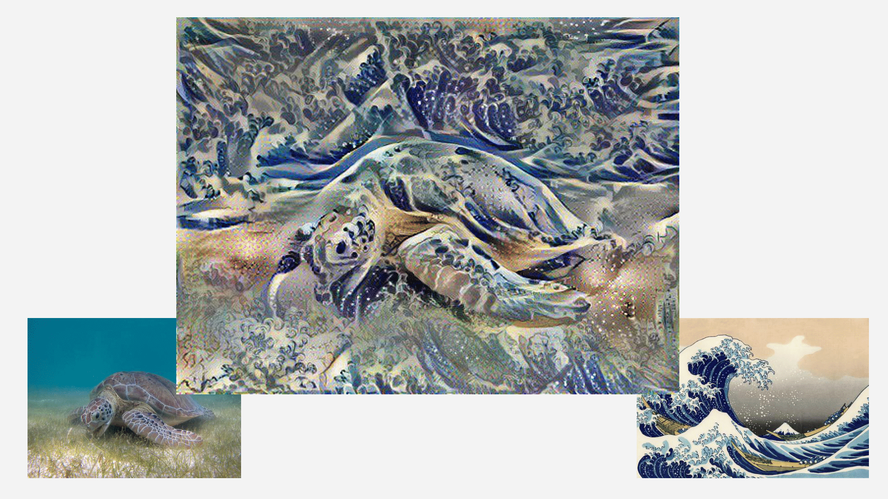
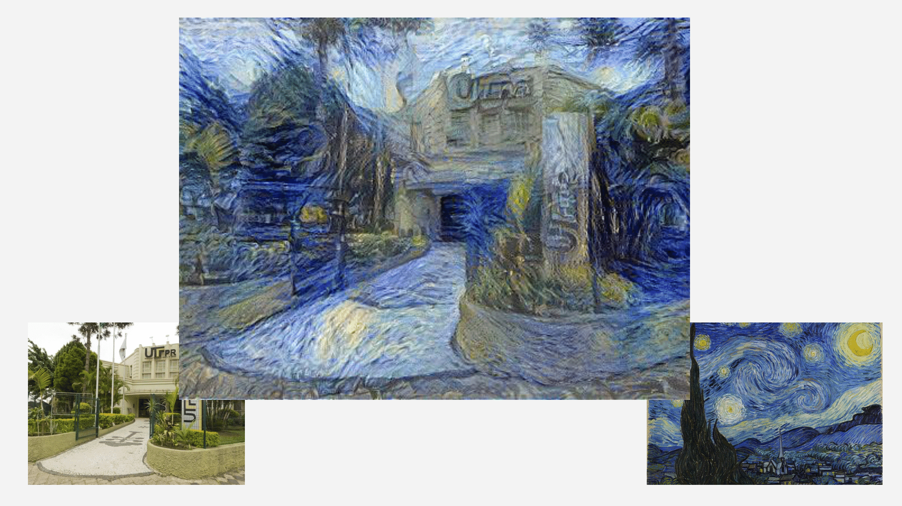
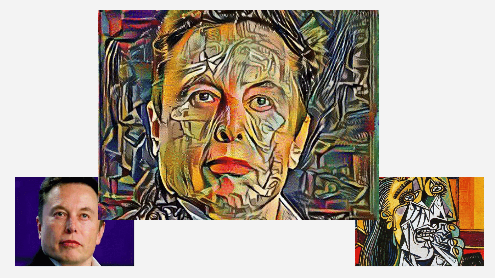
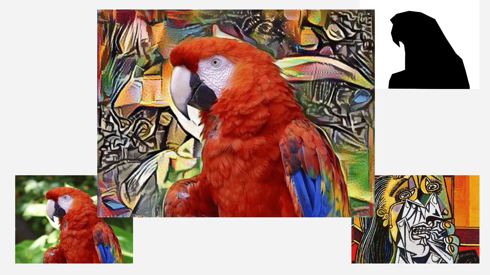
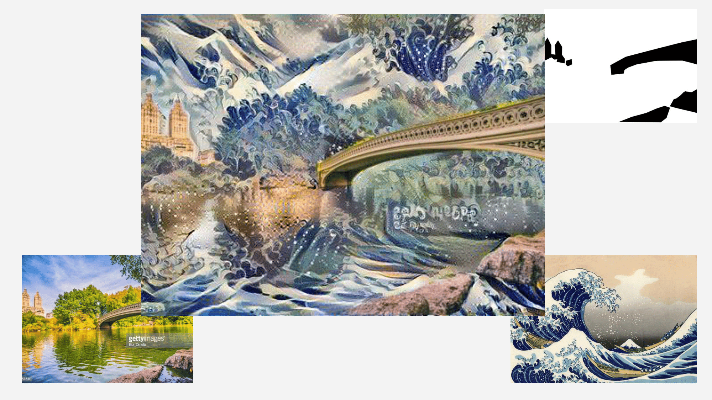
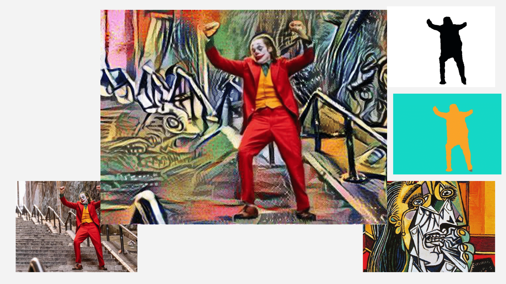
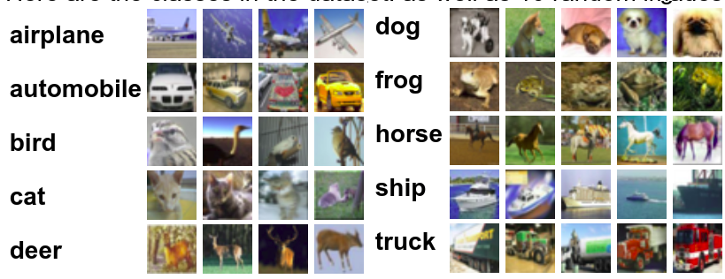
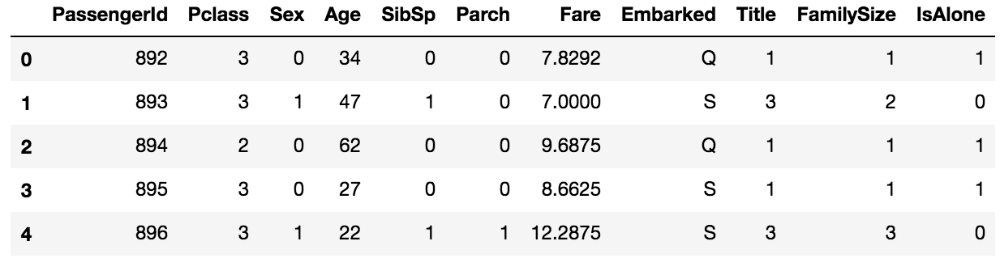

# Reconhecimento de Padrões em Imagens
w/ [Igor](https://github.com/igorlatini) e [Cleverton](https://github.com/clevertoncarneiro)

# 1 Ementa

 - Fundamentos do aprendizado e reconhecimento de padrões em imagens;
 - Extração de descritores;
 - Seleção e combinação de descritores;
 - Agrupamento e aprendizado supervisionado;
 - Classificadores;
 - Avaliação de técnicas de classificação e testes estatísticos.

***

# 2 Projetos
## 2.1 Neural Style Transfer

Retira características do estilo artístico de uma imagem para serem colocadas em outra imagem. Baseado num [post](https://medium.com/tensorflow/neural-style-transfer-creating-art-with-deep-learning-using-tf-keras-and-eager-execution-7d541ac31398) do TensorFlow 2018.

A Grande Onda de Kanagawa | Van Gogh
:-------------------------:|:-------------------------:
 |  
Cubismo | Cubismo com segmentação
 |  
A Grande Onda com segmentação | Cubismo com segmentação automática
 |  

      
   
## 2.2 CIFAR
O desafio consiste em diferenciar 10 classes de objetos: avião, automóvel, passarinho, gato, cachorro, veado, sapo, cavalo, barco e caminhão. O problema e a base de dados estão disponı́veis na plataforma [kaggle](https://www.kaggle.com/c/cifar-10). Foram utilizados modelos de CNN.

## 2.3 Dogs vs Cats
O problema consiste em classificar gatos e cachorros. O problema e a base de dados estão disponı́veis na plataforma [kaggle](https://www.kaggle.com/c/dogs-vs-cats). Foram utilizados modelos de SVM e CNN.

## 2.4 Titanic 

O objetivo foi utilizar diferentes classificadores para identificar quais categorias de pessoas possuem mais chance de sobrevivência. O problema e a base de dados foram extraı́dos da plataforma [kaggle](https://www.kaggle.com/c/titanic/kernels).

***
